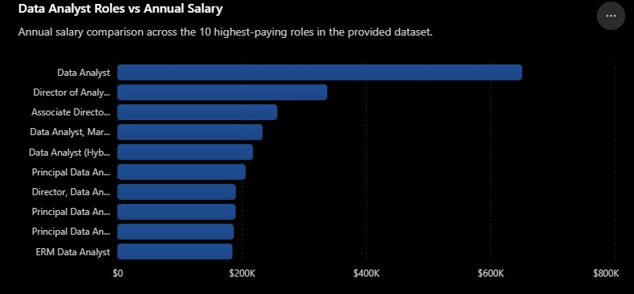
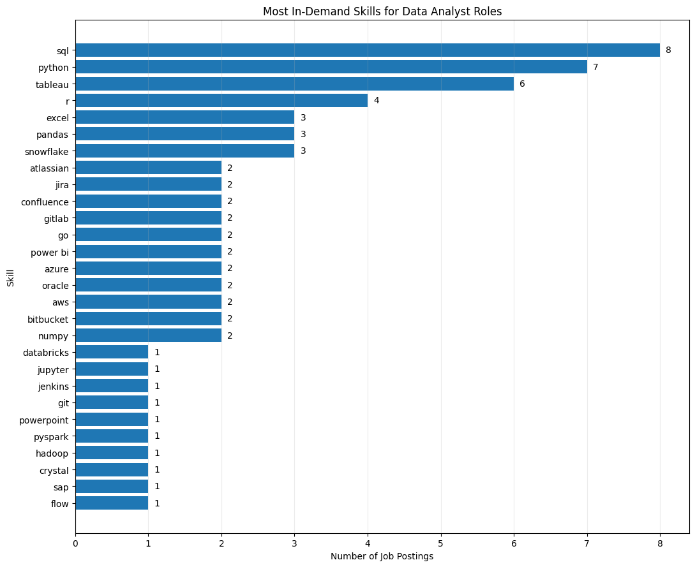

# Introduction
📊 Dive into the data job market! Focusing on data analyst roles, this project explores 💰 top-paying jobs, 🔥 in-demand skills, and where 📈 high demand meets high salary in data analytics.

🔍 SQL queries? Check them out here: [project_sql folder](/SQL%20files/)

# Background
This project analyzes Data Analyst job postings to identify high-paying roles, frequently requested skills, and the relationship between skills, job opportunities, and average salaries. I used PostgreSQL to explore the dataset and answer five questions related to the Data Analyst job market.

[The Data](https://www.lukebarousse.com/sql) is packed with insights on job titles, salaries, locations, and essential skills.

### The analysis focuses on five questions:
1. What are the top-paying data analyst jobs?
2. What skills are required for these top-paying jobs?
3. What skills are most in demand for data analysts?
4. Which skills are associated with higher salaries?
5. What are the most optimal skills to learn?
# Tools I Used
For my deep dive into the data analyst job market, I harnessed the power of several key tools:

- **SQL**: The backbone of my analysis, allowing me to query the database and unearth critical insights.
- **PostgreSQL**: The chosen database management system, ideal for handling the job posting data.
- **Visual Studio Code**: My go-to for database management and executing SQL queries.
- **Git & GitHub**: Essential for version control and sharing my SQL scripts and analysis, ensuring collaboration and project tracking.
# The Analysis
Each query for this project aimed at investigating specific aspects of the data analyst job market. Here’s how I approached each question:

### 1. Top Paying Data Analyst Jobs
To identify the highest-paying roles, I filtered data analyst positions by average yearly salary and location, focusing on remote jobs. This query highlights the high paying opportunities in the field.
```sql
WITH top_salaries AS(
    SELECT 
        job_id,
        job_title,
        company_id,
        job_via,
        job_schedule_type,
        job_posted_date :: DATE,
        salary_year_avg
    FROM 
        job_postings_fact
    WHERE
        job_title_short = 'Data Analyst' AND 
        job_work_from_home = TRUE AND 
        salary_year_avg is NOT NULL
    ORDER BY salary_year_avg DESC
    LIMIT 10
)

SELECT
    ts.job_id,
    ts.job_title,
    cd.name Company_Name,
    ts.job_via,
    ts.job_schedule_type,
    ts.job_posted_date :: DATE,
    ts.salary_year_avg
FROM
    top_salaries AS ts
    LEFT JOIN company_dim as cd
    ON ts.company_id = cd.company_id
```
Here's the breakdown of the top data analyst jobs in 2026:

- **Wide Salary Range**: Top 10 paying data analyst roles span from $184,000 to $650,000, indicating significant salary potential in the field.
- **Diverse Employers**: Companies like SmartAsset, Meta, and AT&T are among those offering high salaries, showing a broad interest across different industries.
- **Job Title Variety**: There's a high diversity in job titles, from Data Analyst to Director of Analytics, reflecting varied roles and specializations within data analytics.


Top Paying Roles Bar graph visualizing the salary for the top 10 salaries for data analysts; ChatGPT generated this graph from my SQL query results

### 2. Skills for Top Paying Jobs
To understand what skills are required for the top-paying jobs, I joined the job postings with the skills data, providing insights into what employers value for high-compensation roles.
```sql
WITH top_salaries AS(
    SELECT 
        job_id,
        job_title,
        name as Company_Name,
        job_via,
        job_schedule_type,
        job_posted_date :: DATE,
        salary_year_avg
    FROM 
        job_postings_fact AS jbf
        LEFT JOIN company_dim as cd
        ON jbf.company_id = cd.company_id
    WHERE
        job_title_short = 'Data Analyst' AND 
        job_work_from_home = TRUE AND 
        salary_year_avg is NOT NULL
    ORDER BY salary_year_avg DESC
    LIMIT 10
)

-- SELECT * from top_salaries;

SELECT
    ts.job_id,
    job_title,
    Company_Name,
    job_via,
    job_schedule_type,
    job_posted_date :: DATE,
    salary_year_avg,
    skills
FROM
    top_salaries as ts
    INNER JOIN skills_job_dim AS sjd
    ON ts.job_id = sjd.job_id
    LEFT JOIN skills_dim as sd
    ON sjd.skill_id = sd.skill_id
```
Here's the frequency of skills listed across the 10 highest-paying remote Data Analyst postings in the dataset:

- SQL is leading with a bold count of 8.
- Python follows closely with a bold count of 7.
- Tableau is also highly sought after, with a bold count of 6. 
- Other skills like R, Snowflake, Pandas, and Excel show varying degrees of demand.


Top Paying Skills Bar graph visualizing the count of skills for the top 10 paying jobs for data analysts; ChatGPT generated this graph from my SQL query results

### 3. In-Demand Skills for Data Analysts
This query helped identify the skills most frequently requested in job postings, directing focus to areas with high demand.

```sql
SELECT 
    skills,
    COUNT(JBF.job_id) as Demand
FROM
    job_postings_fact AS jbf
    INNER JOIN skills_job_dim as sjd
    on jbf.job_id = sjd.job_id
    INNER JOIN skills_dim as sd
    on sjd.skill_id = sd.skill_id
WHERE
    job_title_short = 'Data Analyst'
GROUP BY
    skills
ORDER BY
    Demand DESC
LIMIT 5
```
Here's the breakdown of the most demanded skills for data analysts in 2026

- SQL and Excel remain fundamental, emphasizing the need for strong foundational skills in data processing and spreadsheet manipulation.
- Programming and Visualization Tools like Python, Tableau, and Power BI are essential, pointing towards the increasing importance of technical skills in data storytelling and decision support.

    | Skill    | Demand Count |
    |----------|-------------:|
    | SQL      | 92,628        |
    | Excel    | 67,031        |
    | Python   | 57,326        |
    | Tableau  | 46,554        |
    | Power BI | 39,468       |

Table of the demand for the top 5 skills in data analyst job postings

### 4. Skills Based on Salary
Exploring the average salaries associated with different skills revealed which skills are the highest paying.

```sql
SELECT 
    skills,
    ROUND(AVG(salary_year_avg),2) as Average_Salary
FROM
    job_postings_fact AS jbf
    INNER JOIN skills_job_dim as sjd
    on jbf.job_id = sjd.job_id
    INNER JOIN skills_dim as sd
    on sjd.skill_id = sd.skill_id
WHERE
    job_title_short = 'Data Analyst' and salary_year_avg is NOT NULL
GROUP BY
    skills
ORDER BY
    Average_Salary DESC
LIMIT 10
```
Here's a breakdown of the results for top paying skills for Data Analysts:

- **Highest Average Salaries for Specialized Skills**: PySpark has the highest average salary in this analysis at $208,172, followed by Bitbucket at $189,154 and Couchbase at $160,515. This suggests that specialized technologies associated with large-scale data processing and data infrastructure are linked with higher average salaries among the analyzed job postings.
- **Data & Machine Learning Tools**: Tools such as DataRobot, Jupyter, and Pandas also appear among the highest-paying skills, with average salaries of $155,485, $152,776, and $151,821, respectively. Their presence suggests that skills supporting data analysis, experimentation, and machine learning are associated with relatively high compensation in the dataset.
- **Engineering and Infrastructure Skills**: Skills including GitLab and Elasticsearch have average salaries of $154,500 and $145,000. Their appearance among the highest-paying skills indicates that knowledge extending beyond traditional data analysis into development, search, and data infrastructure may be valuable in higher-paying roles.

    | Skill    | Average Salary |
    |----------|-------------:|
    | pyspark      | 208,172        |
    | bitbucket    | 189,154       |
    | couchbase   | 160,515        |
    | watson  | 160,515         |
    | datarobot | 155,485       |
    | gitlab      | 154,500        |
    | swift    | 153,750       |
    | jupyter   | 152,776        |
    | pandas  | 151,821         |
    | elasticsearch | 145,000       |

Table of the average salary for the top 10 paying skills for data analysts

### 5. Most Optimal Skills to Learn
Combining insights from demand and salary data, this query aimed to pinpoint skills that are both in high demand and have high salaries, offering a strategic focus for skill development.

```sql
  SELECT 
      sd.skills,
      Count(jbf.job_id) as opportunities,
      ROUND(AVG(salary_year_avg),2) AS Avg_salary
  FROM job_postings_fact AS jbf
      LEFT JOIN company_dim AS cd
      ON jbf.company_id = cd.company_id
      INNER JOIN skills_job_dim as sjd
      ON jbf.job_id = sjd.job_id
      LEFT JOIN skills_dim AS sd
      ON sjd.skill_id = sd.skill_id
  WHERE
      job_title_short = 'Data Analyst' AND salary_year_avg IS NOT NULL

  GROUP BY sd.skills
  HAVING
      Count(jbf.job_id)>10
  ORDER BY
      opportunities DESC,
      Avg_salary DESC;
```
| Skills      | Number of opportunities |  Average Salary ($) |
| :--- | ---: | ---: |
| sql          | 3083 | $96,435 |
| excel  | 2143 | $86,418 |
| python      | 1840 | $101,511 |
| tableau   | 1659 | $97,978 |
| r       | 1073 | $98,707 |
| powerbi    | 1044 | $92,323 |
| sas        | 1000 | $93,707 |
| word         | 527 | $82,940 |
| powerpoint       | 524 | $88,315 |
| sql server        | 336 | $96,191 |

Table of Data Analyst skills ranked by number of opportunities, with average salary

Here's a breakdown of the most optimal skills for Data Analysts in 2026:

- **SQL and Excel Lead in Opportunities:**: SQL has the highest number of opportunities in the analysis, appearing in 3,083 job postings, followed by Excel with 2,143 opportunities. This highlights the importance of these foundational skills across Data Analyst positions.
- **Python Has the Highest Average Salary Among the Most In-Demand Skills:**: Python appears in 1,840 opportunities and has an average salary of $101,511, the highest average salary among the six most frequently requested skills in the dataset. R also shows a relatively high average salary of $98,707 across 1,073 opportunities.
- **Data Visualization Skills Remain Highly Relevant:**: Tableau appears in 1,659 opportunities with an average salary of $97,978, while Power BI appears in 1,044 opportunities with an average salary of $92,323. This indicates that both visualization and business intelligence tools are commonly associated with Data Analyst roles.
- **Specialized Database and Office Skills Show Lower Opportunity Counts:** SQL Server appears in 336 opportunities with an average salary of $96,191, while Word and PowerPoint appear in 527 and 524 opportunities, with average salaries of $82,940 and $88,315, respectively.
  
# What I Learned
Through this project, I strengthened my understanding of PostgreSQL, including CTEs, joins, aggregation, filtering, and grouping. I also practiced translating business questions into SQL queries and interpreting the resulting data.

# Conclusions
### Insights
From the analysis, several general insights emerged:

1. The top 10 remote Data Analyst postings in the dataset show a wide salary range, from $184,000 to $650,000. These figures represent the salary values recorded in the dataset and may include unusually high or specialized positions.
2. Skills for Top-Paying Jobs: SQL was the most frequently listed skill among the top 10 highest-paying remote Data Analyst jobs, appearing in 8 of the 10 postings.
3. Most In-Demand Skills: SQL is also the most demanded skill in the data analyst job market, thus making it essential for job seekers.
4. Skills with Higher Salaries: Specialized skills, such as pyspark, bitbucket and couchbase, are associated with the highest average salaries, indicating a premium on niche expertise.
5. Optimal Skills for Job Market Value: SQL leads in demand and offers for a high average salary, positioning it as one of the most optimal skills for data analysts to learn to maximize their market value.
### Closing Thoughts
This project enhanced my SQL skills and provided valuable insights into the data analyst job market. The findings from the analysis serve as a guide to prioritizing skill development and job search efforts. Aspiring data analysts can better position themselves in a competitive job market by focusing on high-demand, high-salary skills. This exploration highlights the importance of continuous learning and adaptation to emerging trends in the field of data analytics.
